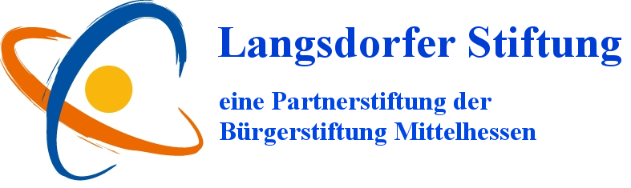

|[Home](index.md)|[Downloads](downloads.md)|[Impressum](impressum.md)|

# Home 

Die Langsdorfer Stiftung wurde als Partnerstiftung der Bürgerstiftung Mittelhessen am 29. September 2008 gegründet. Das Stiftungskapital wurde durch die Gelder der Vereinsgemeinschaft „Dolles Dorf Langsdorf“ und durch Zuwendungen einzelner Langsdorfer Bürgerinnen und Bürger aufgebracht.

Seitdem wurden jedes Jahr verschiedene Projekte unterstützt; z. B. an der Grundschule Langsdorf: JEKI (jedem Kind ein Musikinstrument), ein Bausystem (Möbel) für den Betreuungsverein der Schule, T-Shirts für die Jugend des Tennisvereins, Funkgeräte für die Jugendfeuerwehr, Bücher und Hörbücher für die Langsdorfer Bücherei usw.

Entsprechend ihrem Stiftungszweck will die Langsdorfer Stiftung gesellschaftliche Vorhaben fördern, die im Interesse der Gemeinde und ihrer Bürgerinnen und Bürger liegen. Vor allem will die Stiftung den Gemeinschaftssinn im Dorf und die Mitverantwortung der Bürgerinnen und Bürger in unserem Dorf fördern und stärken und damit dazu beitragen, dass Langsdorf sich positiv entwickelt.

Auf Ihre Antwort freuen wir uns.

Mit freundlichen Grüßen

Für den Stiftungsbeirat Sibylle Starzacher (Vorsitzende) 

Für eine Förderung können Sie sich das Formular für [Sachkostenerstattung](downloads/Sachkostenerstattung.pdf) unter dem Button [Downloads](downloads.md)) herunterladen und die ausgefüllten Formulare bei der Vorsitzenden Sibylle Starzacher, Licher Pforte 25, 35423 Lich-Langsdorf oder bei dem stellvertretenden Vorsitzenden Pfarrer Hans-Peter Gieß, Am Geiersberg 12, 35423 Lich-Langsdorf abgeben

{:width="500px"}
